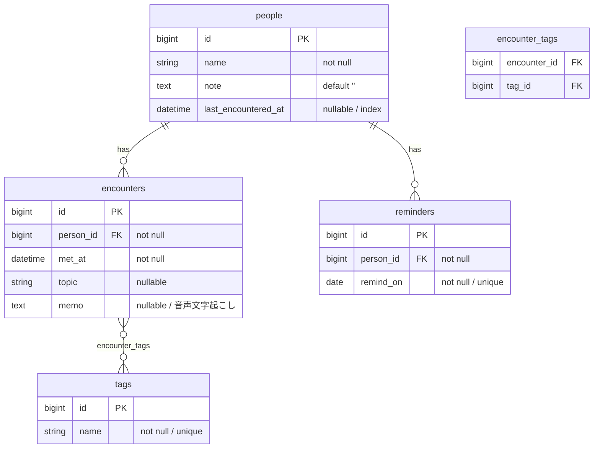

# DB 設計

> **状態: MVP 分は確定。** マイグレーション追加時はこのファイルを同じ PR で更新する。

## ER 図

## テーブル定義

### people

| カラム | 型 | 制約 | 備考 |
|---|---|---|---|
| `name` | string | null: false | あだ名・曖昧可。空文字は不可 |
| `note` | text | null: false, default: "" | 自由記述メモ |
| `last_encountered_at` | datetime | index | 最新 encounter の `met_at` を非正規化 |
| `created_at` / `updated_at` | datetime | | |

- `last_encountered_at` は **encounters から都度 MAX を引かず、非正規化して持つ**(確定)。
  想起バッチが「30 日以上会っていない人」を index scan で引けるようにするため。
  更新責務は Encounter モデルに置く(作成・削除時に person の値を再計算)。
- 同名の人物は別レコードとして許容する。名寄せはしない(MVP)。

### encounters

| カラム | 型 | 制約 | 備考 |
|---|---|---|---|
| `person_id` | bigint | null: false, FK | |
| `met_at` | datetime | null: false | 未指定なら API 層で現在時刻を補完 |
| `topic` | string | | 何を話したか(一行) |
| `memo` | text | | 音声入力の文字起こしテキスト |
| `created_at` / `updated_at` | datetime | | |

- 複合 index: `[person_id, met_at]`(人物詳細で履歴を新しい順に引く)

### tags

| カラム | 型 | 制約 | 備考 |
|---|---|---|---|
| `name` | string | null: false, unique index | `ハッカソン` `STECH` など。`#` は保存しない |

- タグは encounter 作成時に名前で find_or_create する(タグ管理画面は作らない)

### encounter_tags

| カラム | 型 | 制約 |
|---|---|---|
| `encounter_id` | bigint | null: false, FK |
| `tag_id` | bigint | null: false, FK |

- 複合 unique index: `[encounter_id, tag_id]`

### reminders

想起バッチが「今日思い出す 1 人」として選んだ記録。

| カラム | 型 | 制約 | 備考 |
|---|---|---|---|
| `person_id` | bigint | null: false, FK | |
| `remind_on` | date | null: false, **unique index** | 1 日 1 件を DB 制約で保証 |
| `created_at` / `updated_at` | datetime | | |

- `remind_on` 単独の unique index が「1 日 1 人」の保証そのもの。
  バッチが多重起動しても 2 件目は挿入できない(ジョブ側は rescue して無視)。
- `[person_id, remind_on]` ではなく `remind_on` 単独が unique である点に注意。

## 決定済み事項(旧・未決事項)

| 論点 | 決定 | 理由 |
|---|---|---|
| `last_encountered_at` の持ち方 | people に非正規化 | 想起バッチの抽出条件。都度 MAX 集計を避ける |
| 音声入力の構造化 | しない。文字起こしテキストを `encounters.memo` に平文で保存 | 構造化はオンデバイス文字起こしの精度と継続実績を見てから |
| ユーザー(アカウント) | 単一ユーザー前提。users テーブルは作らない | 開発者自身が一人目のユーザー。公開時に再検討 |
